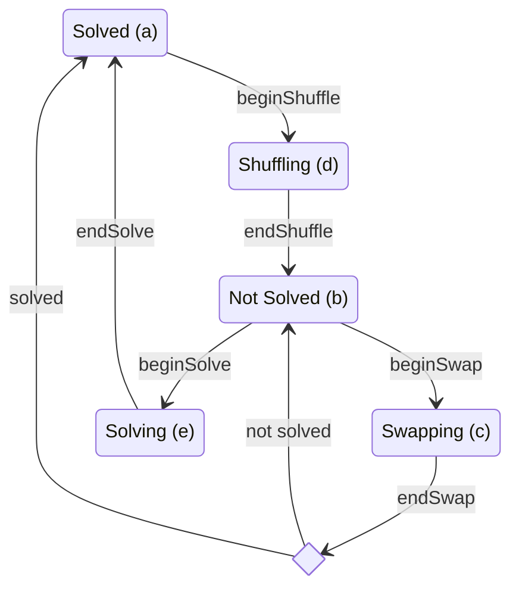

# 15-puzzle

[Play](https://grancalavera.github.io/15-puzzle/)

```mermaid
stateDiagram

a: Solved (a)
b: Not Solved (b)
c: Swapping (c)
d: Shuffling (d)
e: Solving (e)

state c1 <<choice>>

a --> d: beginShuffle
d --> b: endShuffle

b --> c: beginSwap
c --> c1: endSwap

c1 --> b: not solved
c1 --> a: solved

b --> e: beginSolve
e --> a: endSolve
```
